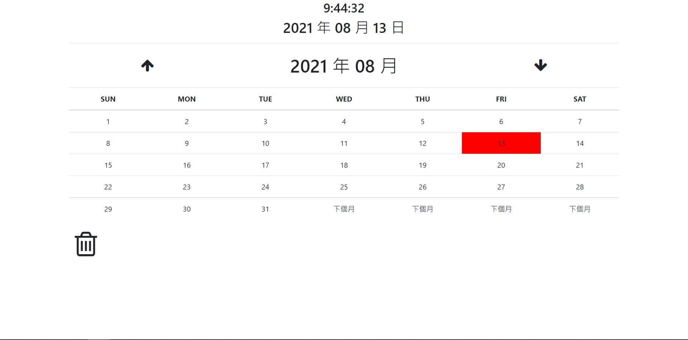
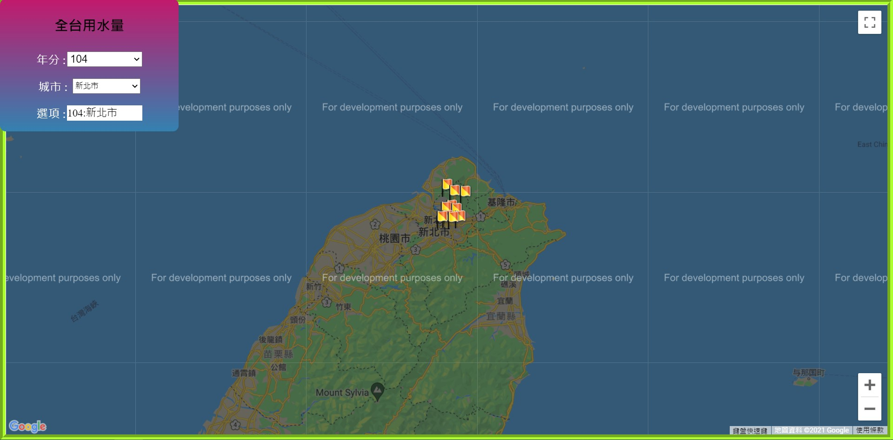

# Haowei.github

## 行事曆 [作品連結](https://wu-haowei.github.io/Operation/Calendar.html)
#### JavaScript動態生成日期，並以Local Storage存取達到代辦事項的功能
#### (新增 / 修改 / 刪除)

## 用水量查詢地圖 [作品連結](https://wu-haowei.github.io/Operation/google_map.html)
#### 模擬資料庫，去做商品規格查詢,JavaScript動態生成資料使用Fetch取得各區域的經緯度、用水量資料，並配合JSON資料的處理，最後再使用Google Map API，將資料標記在各區域的地點當中

## APPLE 
[作品連結](https://wu-haowei.github.io/Operation/APPLE.html)
#### 模擬資料庫，做商品規格查詢，搭配JavaScript動態生成資料

## 復刻-Build School 官網 [作品連結](https://wu-haowei.github.io/Operation/build%20school.html)
#### 使用Html+CSS+Bootstrap+RWD，刻出Build School 商業網站首頁，超高相似度

## 復刻-Imperion 官網 [作品連結](https://wu-haowei.github.io/Operation/operation-3.html)
#### 使用Html+CSS，刻出Imperion商業網站首頁，超高相似度。 

